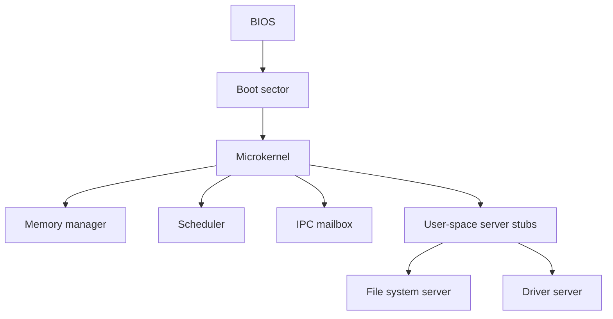

# Microkernel ASM

Kernel minimo experimental em Assembly para estudar boot, arquitetura de
microkernel, IPC, escalonamento e memoria em baixo nivel.

## Estado atual

**Milestone 0:** base bootavel BIOS em modo real de 16 bits.

O projeto agora gera uma imagem `build/os.img` com:

- boot sector valido;
- kernel carregado em `0x1000`;
- tela VGA em estilo terminal Unix/DOS;
- saida serial COM1 para debug;
- inicializacao de memoria, scheduler, IPC e stubs de servidores;
- testes de build e qualidade via `make check` e `make quality`.

## Previa

```text
 microkernel.asm  v0.1  |  signed by @ghostroot
 --------------------------------------------------------

 [ok] memory allocator online
 [ok] round-robin scheduler table online
 [ok] ipc mailbox online
 [ok] user-space server stubs registered

 root@microkernel:/# _
```

## Arquitetura



## Estrutura

```text
.
├── boot/
│   └── boot.asm
├── docs/
│   ├── architecture.md
│   ├── error-analysis.md
│   └── testing.md
├── include/
│   └── kernel.inc
├── kernel/
│   ├── ipc.asm
│   ├── kernel.asm
│   ├── memory.asm
│   └── scheduler.asm
├── scripts/
│   └── quality.sh
├── servers/
│   ├── driver_server.asm
│   └── fs_server.asm
└── Makefile
```

## Dependencias

```sh
sudo apt install nasm make qemu-system-x86
```

## Build e testes

```sh
make
make check
make quality
```

Executar no QEMU:

```sh
make run
```

Debug:

```sh
make debug
```

## Documentacao

- [Arquitetura](docs/architecture.md)
- [Analise de erros](docs/error-analysis.md)
- [Assinatura digital](docs/signature.md)
- [Testes e qualidade](docs/testing.md)

## Roadmap

- [x] Boot sector BIOS valido
- [x] Kernel minimo carregado por disco
- [x] Console VGA com aparencia inicial
- [x] Stubs de memoria, scheduler, IPC e servidores
- [ ] Ativar A20
- [ ] Entrar em protected mode
- [ ] Criar GDT/IDT reais
- [ ] Entrar em long mode x86-64
- [ ] Implementar paginacao PML4
- [ ] Implementar interrupcao de timer
- [ ] Implementar troca de contexto real
- [ ] Criar ABI de IPC para servidores
- [ ] Adicionar processos ring3
- [ ] Criar loader ELF simples

## Convencao de commits

Use mensagens objetivas por area:

```text
boot: implement disk loader
kernel: add vga console
docs: document milestone 0
test: add image quality checks
```

## Licenca

MIT.
