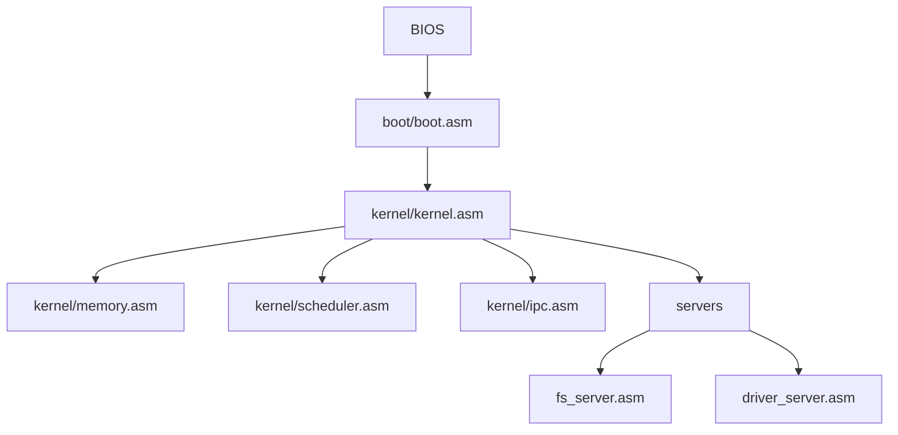

# Arquitetura de software

## Objetivo

O objetivo do projeto e construir um microkernel minimo em Assembly, evoluindo
por marcos pequenos e verificaveis. O progresso passa por transição para protected mode,
long mode x86-64, interrupções reais, isolamento de ring3 e syscalls.

## Status atual

**Milestone 1: Protected Mode** ✅ (em progresso)
- ✅ A20 ativada no bootloader
- ✅ GDT setup inicial  
- ✅ Transição para protected mode (32-bit)
- 🔄 Interrupções e exceções
- 🔄 Timer e troca de contexto real

## Milestone 0: base bootavel (✅ COMPLETO)



## Responsabilidades

| Modulo | Responsabilidade atual |
| --- | --- |
| `boot/boot.asm` | Setor de boot BIOS, leitura do kernel do disco, ativação A20 e salto para `0x1000`. |
| `kernel/kernel.asm` | Entrada do kernel real-mode, pilha, segmentos, serial, VGA e orquestracao dos subsistemas (Milestone 0). |
| `kernel/kernel_pm.asm` | Entrada do kernel protected-mode (32-bit), transição de modo real/protegido (Milestone 1). |
| `kernel/pm_setup.asm` | Ativação A20, setup GDT, entrada protected mode (Milestone 1). |
| `kernel/memory.asm` | Alocador linear minimo de paginas de 4 KiB. |
| `kernel/scheduler.asm` | Estado inicial de tarefas e avanco round-robin cooperativo. |
| `kernel/ipc.asm` | Mailbox unica para validar o contrato inicial de mensagens. |
| `servers/*.asm` | Stubs de servidores fora do nucleo para preservar a direcao microkernel. |

## Aparencia inicial

A tela atual usa VGA texto para simular uma experiencia de terminal moderna:

```text
 microkernel.asm  v0.1  |  signed by @ghostroot
 --------------------------------------------------------

 [ok] memory allocator online
 [ok] round-robin scheduler table online
 [ok] ipc mailbox online
 [ok] user-space server stubs registered

 root@microkernel:/# _
```

## Evolucao planejada

1. ✅ Trocar o kernel real-mode por uma transicao clara para protected mode.
2. ✅ Ativar A20, GDT e rotina de erro de boot mais robusta.
3. Entrar em long mode x86-64 com paginação PML4 minima.
4. Criar interrupcoes, timer e troca de contexto real.
5. Separar servidores em tarefas com ABI de IPC.
6. Adicionar syscalls, isolamento ring3 e loader ELF simples.
