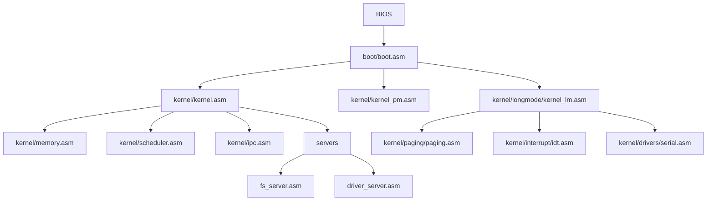

# Arquitetura de software - NeXus

## Objetivo

O objetivo do NeXus e construir um microkernel minimo em Assembly, evoluindo
por marcos pequenos e verificaveis. O progresso passa por transição para
protected mode, long mode x86-64, interrupções reais, isolamento de ring3,
syscalls e produtos funcionais em volta do nucleo.

**Versão atual:** `0.2.0-m2`

## Status atual

**Milestone 2: Long Mode** 🔄 (em desenvolvimento)
- ✅ Estrutura de pastas para modularização
- ✅ Paginação PML4 minima com identity mapping de 1 GiB no bootstrap
- ✅ IDT com exception handlers (0, 8, 13, 14)
- ✅ Transição real-mode → protected-mode → long mode (64-bit)
- ✅ Kernel entry em 64 bits
- ✅ Serial console 64-bit separado em `kernel/drivers/serial.asm`
- 🔄 Validação de exceções e page fault controlado

**Milestone 1: Protected Mode** ✅ (completo)
- ✅ A20 ativada no bootloader
- ✅ GDT setup inicial  
- ✅ Transição para protected mode (32-bit)
- ✅ Interrupções e exceções básicas
- ✅ Timer e troca de contexto cooperativo



## Responsabilidades

| Modulo | Responsabilidade atual |
| --- | --- |
| `boot/boot.asm` | Setor de boot BIOS, leitura do kernel do disco, ativação A20 e salto para `0x1000`. |
| `kernel/kernel.asm` | Entrada do kernel real-mode, pilha, segmentos, serial, VGA e orquestracao dos subsistemas (Milestone 0). |
| `kernel/kernel_pm.asm` | Entrada do kernel protected-mode (32-bit), transição de modo real/protegido (Milestone 1). |
| `kernel/longmode/kernel_lm.asm` | Bootstrap M2: entrada 16-bit, salto para 32-bit, ativação de PAE/PML4/EFER.LME e entrada 64-bit. |
| `kernel/longmode/longmode.asm` | Rotinas e constantes de referência para a transição 32-bit → 64-bit. |
| `kernel/paging/paging.asm` | Estado minimo de paginação e alocador físico bump para M2. |
| `kernel/interrupt/idt.asm` | IDT x86-64 com handlers de exceções críticas e halt diagnóstico por serial. |
| `kernel/drivers/serial.asm` | Driver COM1 em 64 bits para logs do M2. |
| `kernel/pm_setup.asm` | Ativação A20, setup GDT, entrada protected mode (Milestone 1). |
| `kernel/memory.asm` | Alocador linear minimo de paginas de 4 KiB. |
| `kernel/scheduler.asm` | Estado inicial de tarefas e avanco round-robin cooperativo. |
| `kernel/ipc.asm` | Mailbox unica para validar o contrato inicial de mensagens. |
| `servers/*.asm` | Stubs de servidores fora do nucleo para preservar a direcao microkernel. |

## Produtos NeXus

| Produto | Responsabilidade |
| --- | --- |
| **NeXus Core** | Kernel, memoria, interrupcoes, scheduler e IPC. |
| **NeXus Boot** | Boot BIOS atual e futuros loaders/UEFI. |
| **NeXus Drivers** | Serial, VGA, timer, teclado, disco e virtio. |
| **NeXus Services** | Servidores isolados de FS, drivers e init. |
| **NeXus Runtime** | Syscalls, ABI de IPC, loader ELF e biblioteca userspace. |
| **NeXus SDK** | Ferramentas de build, debug, exemplos e testes de contrato. |

## Aparencia inicial

A tela atual usa VGA texto para simular uma experiencia de terminal moderna:

```text
 NeXus  v0.2.0-m2  |  signed by @ghostroot
 --------------------------------------------------------

 [ok] memory allocator online
 [ok] round-robin scheduler table online
 [ok] ipc mailbox online
 [ok] user-space server stubs registered

 root@nexus:/# _
```

## Evolucao planejada

1. ✅ Trocar o kernel real-mode por uma transicao clara para protected mode.
2. ✅ Ativar A20, GDT e rotina de erro de boot mais robusta.
3. ✅ Entrar em long mode x86-64 com paginação PML4 minima.
4. 🔄 Criar interrupcoes, timer e troca de contexto real.
5. Separar servidores em tarefas com ABI de IPC.
6. Adicionar syscalls, isolamento ring3 e loader ELF simples.
7. Criar runtime e servidores em C ou Rust apos estabilizar ABI e loader.

## Estrutura de Diretórios (Milestone 2+)

```
kernel/
├── paging/              # Módulo de paginação PML4
│   ├── README.md
│   └── paging.asm        # Estado de paginação e page allocator inicial
├── interrupt/           # Módulo de IDT e exceções
│   ├── README.md
│   └── idt.asm           # IDT x86-64 e handlers de exceção
├── longmode/            # Módulo de transição 64-bit
│   ├── README.md
│   ├── longmode.asm
│   └── kernel_lm.asm
├── drivers/             # Drivers de hardware
│   ├── README.md
│   ├── serial.asm        # COM1 em 64 bits para debug
│   └── (outros)
├── kernel.asm           # Entry real-mode (M0)
├── kernel_pm.asm        # Entry protected-mode (M1)
├── pm_setup.asm
├── memory.asm
├── scheduler.asm
└── ipc.asm
```

## Trilha futura C/Rust

A base de bring-up permanece em Assembly: boot, GDT, IDT, transicoes de modo,
syscall entry e context switch. Apos os milestones de interrupcoes, IPC e ELF,
o NeXus pode ganhar:

- **NeXus-C**: runtime inicial, servidores simples e testes de ABI.
- **NeXus-RS**: servidores `no_std`, bibliotecas de usuario e componentes com
  mais estado interno.

Essa transicao deve acontecer por modulo, mantendo chamadas e estruturas de
dados documentadas para evitar que a linguagem esconda contratos criticos.

## Compilação

- **M0 (Real-mode)**: `make` ou `make all`
- **M1 (Protected-mode)**: `make pm`
- **M2 (Long-mode)**: `make lm` (novo)
