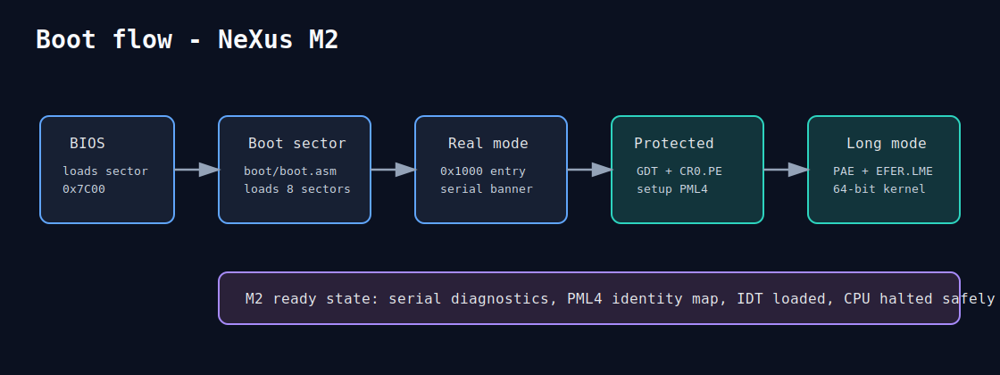

# 02 - Arquitetura


## Camadas

O NeXus usa uma separacao simples:

| Camada | Responsabilidade |
| --- | --- |
| Boot | BIOS boot sector, leitura do kernel e salto para `0x1000`. |
| Core | Entrada do kernel, modos de CPU, memoria, interrupcoes e scheduler. |
| Drivers | Rotinas de hardware essenciais, com serial COM1 primeiro. |
| Services | Servidores fora do nucleo, inicialmente como stubs. |
| Runtime | Syscalls, IPC ABI, loader ELF e bibliotecas userspace. |
| SDK | Build, debug, exemplos, testes e documentacao de contratos. |

## Fluxo de boot



1. BIOS carrega o setor de boot em `0x7C00`.
2. `boot/boot.asm` carrega 8 setores para `0x1000`.
3. O kernel M2 inicia em real mode.
4. A GDT e carregada.
5. O bit `CR0.PE` entra em protected mode.
6. Tabelas PML4/PDPT/PD sao inicializadas em memoria fixa.
7. `CR4.PAE`, `CR3` e `EFER.LME` preparam long mode.
8. `CR0.PG` ativa paginação.
9. Um far jump entra no segmento 64-bit.
10. `kernel_main_64` inicializa serial, paging e IDT.

## Estrutura de diretorios relevante

```text
boot/
└── boot.asm

kernel/
├── kernel.asm              # M0 real-mode
├── kernel_pm.asm           # M1 protected-mode
├── longmode/
│   ├── kernel_lm.asm       # M2 bootstrap 16/32/64-bit
│   └── longmode.asm        # Rotinas de referencia
├── paging/
│   └── paging.asm          # Estado de paginação e alocador inicial
├── interrupt/
│   └── idt.asm             # IDT e excecoes
├── drivers/
│   └── serial.asm          # COM1 64-bit
├── memory.asm
├── scheduler.asm
└── ipc.asm

servers/
├── fs_server.asm
└── driver_server.asm
```

## Fronteiras

- Boot nao deve acumular logica de kernel.
- Core deve manter apenas primitivas essenciais.
- Drivers devem ficar em `kernel/drivers/` ate haver isolamento em ring3.
- Servidores devem evoluir para tarefas separadas.
- Runtime so deve crescer depois de syscall, IPC e ELF terem contrato claro.

## Riscos conhecidos

- M2 ainda assume suporte da CPU a PAE/long mode.
- `page_free` e stub; alocacao real fica para milestones seguintes.
- IDT inicial diagnostica excecoes, mas ainda nao ha IRQ/timer real.
- O loader ainda usa limite de 8 setores por kernel.
