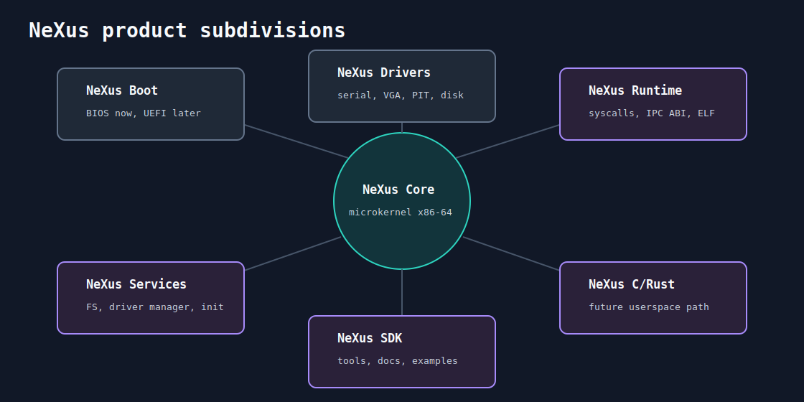

# 05 - Produtos

NeXus e dividido em produtos para manter responsabilidades claras. Isso evita
que o kernel absorva tudo e ajuda a planejar entregas reais.

## NeXus Core

O microkernel em si.

Escopo:
- boot handoff;
- modos de CPU;
- memoria e paginação;
- interrupcoes;
- timer;
- scheduler;
- IPC de baixo nivel;
- syscalls.

Fora de escopo:
- filesystem completo;
- drivers complexos;
- rede;
- shell;
- bibliotecas de usuario.

## NeXus Boot

Responsavel por carregar o kernel e preparar o ambiente inicial.

Estado atual:
- BIOS boot sector;
- leitura de setores;
- A20;
- salto para `0x1000`.

Futuro:
- UEFI;
- mapa de memoria;
- boot config;
- carregamento de kernel maior.

## NeXus Drivers

Drivers essenciais.

Estado atual:
- serial COM1.

Proximos:
- VGA text;
- PIT;
- teclado PS/2;
- disco;
- virtio.

## NeXus Services

Servidores fora do nucleo.

Primeiros candidatos:
- filesystem;
- driver manager;
- init;
- console;
- log service.

## NeXus Runtime

Contrato entre kernel e userspace.

Inclui:
- syscall ABI;
- IPC ABI;
- loader ELF;
- biblioteca minima;
- startup code para programas.

## NeXus SDK

Ferramentas para desenvolver em cima do NeXus.

Inclui:
- scripts de build;
- exemplos userspace;
- validadores de ABI;
- docs de syscalls;
- guias de debug.
