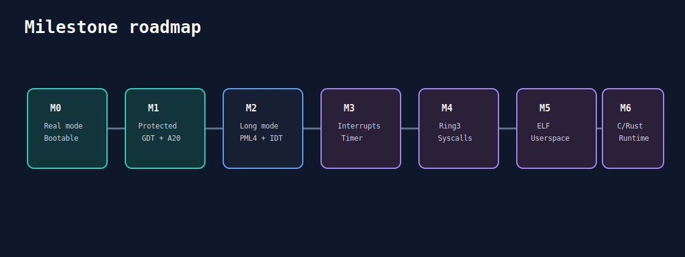

# 06 - Roadmap

## M0 - Base bootavel

Status: completo.

- boot sector BIOS;
- kernel real-mode;
- VGA text;
- serial COM1;
- alocador linear;
- scheduler cooperativo;
- IPC mailbox;
- stubs de servidores.

## M1 - Protected mode

Status: completo.

- A20;
- GDT;
- `CR0.PE`;
- entrada 32-bit;
- build `make pm`.

## M2 - Long mode

Status: em desenvolvimento.

- bootstrap M2;
- PML4 minima;
- identity mapping inicial;
- entrada 64-bit;
- IDT inicial;
- serial 64-bit;
- build `make lm`.

Pendencias:
- CPUID check;
- teste de page fault controlado;
- handlers de excecao mais completos;
- limite maior de kernel carregado.

## M3 - Interrupcoes e timer

Objetivo:
- configurar PIT;
- registrar IRQ0;
- salvar/restaurar contexto;
- iniciar scheduler preemptivo;
- validar excecoes x86-64.

## M4 - Ring3, syscalls e IPC

Objetivo:
- TSS;
- stacks de kernel por tarefa;
- entrada syscall/sysret;
- isolamento ring3;
- IPC com validacao.

## M5 - ELF e userspace

Objetivo:
- parser ELF64;
- loader de segmentos;
- BSS zero;
- primeiro programa userspace;
- servidores isolados.

## M6 - Runtime C/Rust

Objetivo:
- headers C de ABI;
- runtime minimo;
- primeiro binario C userspace;
- avaliar Rust `no_std`;
- definir linker scripts e panic strategy.
