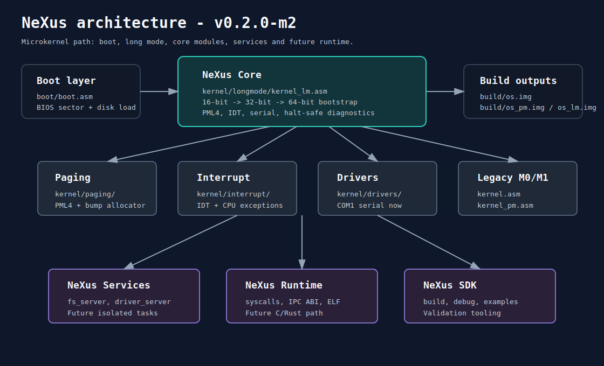

# Wiki NeXus

Bem-vindo a wiki local do NeXus. Esta area organiza a documentacao do projeto
como uma base de conhecimento navegavel, cobrindo arquitetura, build, produtos,
milestones e evolucao futura.

## Leitura rapida

| Pagina | Quando usar |
| --- | --- |
| [01 - Visao Geral](01-overview.md) | Entender o que e o NeXus e qual problema ele resolve. |
| [02 - Arquitetura](02-architecture.md) | Entender camadas, modulos e limites do kernel. |
| [03 - Build e Execucao](03-build-and-run.md) | Compilar M0, M1, M2 e executar no QEMU. |
| [04 - Modulos do Kernel](04-kernel-modules.md) | Localizar responsabilidades em `kernel/`. |
| [05 - Produtos](05-products.md) | Entender NeXus Core, Boot, Drivers, Services, Runtime e SDK. |
| [06 - Roadmap](06-roadmap.md) | Acompanhar milestones M0 a M6. |
| [07 - Debug e Qualidade](07-debug-quality.md) | Validar imagens, serial, GDB e checks estaticos. |
| [08 - Guia de Contribuicao](08-contributing.md) | Padrao de commits, escopo e fluxo de trabalho. |
| [09 - Futuro C/Rust](09-c-rust-future.md) | Planejar a transicao para runtime e userspace em C/Rust. |
| [10 - Glossario](10-glossary.md) | Consultar termos de baixo nivel. |

## Estado atual

Versao atual: `0.2.0-m2`

O NeXus esta no Milestone 2:

- boot BIOS legado;
- entrada real-mode em `0x1000`;
- transicao para protected mode;
- ativacao de PAE, PML4 e long mode;
- entrada 64-bit;
- serial COM1 em 64 bits;
- IDT inicial de excecoes;
- paginação minima com identity map inicial.

## Imagens

As imagens da wiki ficam em [assets](assets/):

- [nexus-architecture.svg](assets/nexus-architecture.svg)
- [boot-flow.svg](assets/boot-flow.svg)
- [product-map.svg](assets/product-map.svg)
- [milestone-roadmap.svg](assets/milestone-roadmap.svg)

Elas sao SVG versionados no repositorio para facilitar manutencao e revisao.
